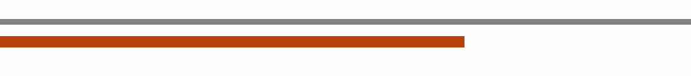
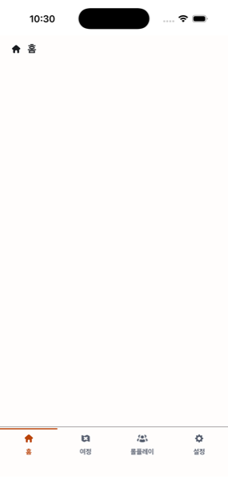

# 탭 세 개를 오간다

전제: 공통 전제와 같다 (자체 호스트 앱, **로그인된 상태** — [진입 흐름](entry-flow.md)을
한 번 통과해 토큰이 있는 설치). 그 상태에서 앱을 켜면 스플래시가 자동으로 전이한 뒤
(고정 시간, [진입 흐름](entry-flow.md) T8) 첫 화면은 여정 맵이고 바텀 탭은 이미 "여정"이
선택된 채로 시작한다(LIB-257로 홈 탭이 걷혔다. LIB-261로 스플래시 자동 전이 한 겹이
도달 경로에 늘었다 — 절차·관찰은 바뀌지 않는다)

단계:
1. 앱을 띄운다
2. 바텀 네비게이션의 "여정" 탭을 누른다(이미 선택돼 있어 무동작)
3. "롤플레이" · "설정" 탭을 차례로 누른다
4. "여정" 탭으로 돌아온다

관찰:
- 화면 맨 아래에 네비게이션 바가 있고 **높이가 88pt**다 (`layout.bottom-nav.height`)
- 바 위쪽에 **1pt 구분선**이 있고 색이 `#848184`다 (`color.border.default`)
- 탭이 셋이고 각각 **아이콘(24pt) 위 · 라벨 아래**로 쌓여 있다 (`icon.size.md`)
- 아이콘과 라벨 사이 간격이 **4pt**다 (`spacing.4`)
- 라벨은 **12pt Bold**다 (`typography.label-m`)
- **선택된 탭에만** 위쪽에 2pt 막대가 있다 (`stroke-width.strong`) — 비선택 탭에는
  막대 자리가 비어 보이되(배경색과 같아 안 보임) 아이콘·라벨이 2pt 튀지 않는다.
  이것이 색 말고 유일한 선택 표시 채널이고 **WCAG 1.4.1 대응**이다 — 색만으로 상태를
  전달하지 않기 위한 것이므로 빠지면 안 된다
- **그 막대가 구분선에 붙어 있지 않고 2pt 떨어져 있다** (`spacing.2`) — 구분선과 막대
  사이로 배경색이 보인다. **붙어 보이면 되돌아온 것이다**: 둘이 맞닿으면 상호 대비가
  1.42:1이라 회색조에서 하나의 3pt 띠로 뭉치고, "막대가 있는가"였던 신호가 "띠가
  두꺼운가"로 깎인다. 2pt 띄우면 막대의 양옆이 둘 다 배경이 되어 5.38:1이 된다
- 선택된 탭의 아이콘·라벨 색과 나머지 셋의 아이콘·라벨 색이 **`#B94208`(선택) /
  `#555D6D`(비선택)** 인 것을 **스크린샷 픽셀을 읽어** 확인한다. **눈으로 보는 것으로는
  판정하지 않는다** — 두 색의 상호 대비가 **1.21:1**이라 회색조에서는 구별되지 않는다.
  "선택된 탭이 강조돼 보인다"는 관찰로는 아무것도 판정되지 않는다. 위 지시선 항목이
  실제로 눈에 띄는 유일한 선택 신호다
- 탭을 누르면 각 탭의 화면 제목("여정 맵" · "롤플레이" · "설정")이 뜬다. **탭 라벨과
  화면 제목이 다른 것이 정상이다** — 여정 탭의 라벨은 "여정"인데 그 화면 제목은
  "여정 맵"이다. 다르게 뜬 것을 버그로 보지 않는다
- 라벨 아래끝이 화면 바닥에서 **35pt** 떨어져 있고, 홈 인디케이터가 라벨을 덮지 않는다.
  **여유가 1pt뿐이다** — 홈 인디케이터가 34pt이므로 닿는지를 특히 본다 (아래 4번)
- 화면 콘텐츠가 네비게이션 바에 **가려지지 않는다** — 화면 배경이 바 위에서 끝난다

## 실기에서만 판정되는 것

> **2026-09-04 — LIB-226 스크롤 항목은 미판정이다.** 같은 날 실기에서 **S9(스크롤 성립)만
> 통과**했고(`listening.md` 참고), 이 문서의 스크롤 항목들은 **걸어서 훑는 중 눈에 띄는
> 이상이 없었다**는 것까지다. **수치를 재는 항목(S15의 선 y좌표 · S12의 모양)과
> VoiceOver 축은 미확인**이다.

**자동 계층이 원리적으로 못 보는 것을 여기 모아 둔다.** 흩어 두면 어느 것이 아직
확인되지 않았는지 셀 수 없다. **열두 개 중 열을 판정했고 전부 통과했다.**
하나(6번)는 한 번 실패한 뒤 결정을 바꿔 다시 통과시켰다. 둘(8 · 10)은 아직 보지 않았다.

못 보는 이유가 둘이다.

- **계산된 스타일을 볼 수 없다.** jsdom이 Lynx 스타일을 계산하지 않는다
  (ADR-0006 D4, `docs/conventions/code.md`). 1~4·11·12번이 여기 걸린다.
- **속성이 붙었다는 것과 보조기술이 그것을 쓸 만하게 읽는다는 것은 다르다.**
  `ui`는 `toHaveAttribute`로 **부착 여부까지만** 본다. 5~10번이 여기 걸린다.

> **수용 기준 8이 닫혔다** — 이름·역할·상태·묶음·제목이 전부 실기에서 확인됐다
> (5 · 6 · 7 · 9). 다만 **한 번 실패한 뒤에 닫혔다**: 처음 고른 `accessibility-value`가
> 낭독되지 않아 채널을 라벨 접미사로 재고정하고 다시 들었다.
> **`ui`가 전부 green인 것은 속성이 붙었다는 뜻이지 보조기술이 그것을 읽는다는 뜻이
> 아니라는 것을, 6번이 실물로 보여줬다.**
>
> **수용 기준 9는 아직 낭독 미확인이다** — 10번(에러 화면의 재시도)을 보지 않았다.
>
> **6번은 그 실패로 결정을 바꿨고 지금은 재판정 대기다** — 상태를 `accessibility-value`가
> 아니라 **이름 뒤 접미사**로 싣는다(ADR-0016 D3 재고정). 아래 6번 항목이 다음에 무엇을
> 들어야 하는지를 적는다.

각 항목은 **식별 가능한 요소와 수치**로 적는다. 인상("자연스럽게 읽힌다")으로는
판정하지 않는다.

### 시각·레이아웃 — 이 스택에서 확인된 바 없는 값

**1. `.app`의 `height: 100vh`가 화면 전체를 잡는가**
- 단계: 앱을 띄운다
- 관찰: 네비게이션 바의 아래끝이 **화면 바닥에 붙어 있다**
- 어긋나면: 셸이 바닥에 붙지 않고 콘텐츠 아래 어딘가에 뜬다. `.app`에 리터럴 높이
  대신 쓸 수 있는 값이 이 스택에 정해진 바 없다

**2. `.bottom-navigator`의 `border-top`이 그려지는가**
- 단계: 앱을 띄우고 바 위쪽 경계를 스크린샷 픽셀로 읽는다
- 관찰: 바 위쪽에 **1pt `#848184` 선**이 있다
- 어긋나면: 구분선이 사라진 채로 셸만 뜬다. **대체안** — 구분선을 지시선과 같은
  방식으로 바꾼다. `border`가 아니라 자식 `<view>`에 `height: 1pt` ·
  `background: color.border.default`를 준다

**3. `.bottom-navigator-tab`의 `padding-top`이 먹는가**
- 단계: 선택된 탭의 지시선과 구분선 사이를 스크린샷 픽셀로 읽는다
- 관찰: 구분선과 지시선 **사이에 배경색 2pt**가 있다 (`--libitum-spacing-2`)
- 어긋나면: **화면은 멀쩡해 보이는데 대비가 되돌아간다.** 지시선이 구분선에 도로
  밀착해 상호 대비 1.42:1로 떨어진다. 토큰이 안 먹는 실패는 조용하다 (ADR-0014 D1).
  **대체안** — 같은 2pt를 `.bottom-navigator-indicator`의 `margin-top`으로 옮긴다.
  `padding`을 고른 것은 터치 영역 때문인데 지시선의 `margin`도 탭 상자를 줄이지
  않으므로 이 대체안 역시 97.5 × 87pt를 지킨다

**4. 하단 여유 35pt에 홈 인디케이터가 닿는가**
- 단계: 홈 인디케이터가 뜬 상태에서 라벨 아래끝과 인디케이터 위끝의 간격을 읽는다
- 관찰: 라벨을 **덮지 않는다.** 여유는 35pt이고 인디케이터가 34pt다 — **1pt뿐이다**
- 어긋나면: 88pt가 홈 인디케이터를 포함한다는 가정이 맞다는 뜻이다. 지시선 간격 2pt를
  지키려면 다른 값을 줄여야 하고, 무엇을 줄일지는 그때 연다

### VoiceOver 낭독 — 속성은 붙었고 낭독은 미확인

전제: 위 단계와 같되 **iOS 설정에서 VoiceOver를 켠 상태**로 시작한다. 판정 환경은
iOS VoiceOver다 (ADR-0012 D1).

**5. 탭 셋이 각각 이름과 역할로 읽히는가**
- 단계: 바 위를 좌→우로 스와이프해 탭 셋을 훑는다
- 관찰: 각 탭이 **"여정" · "롤플레이" · "설정"** 중 하나 + **"버튼"** 으로 읽힌다.
  라벨 문구와 낭독되는 이름이 **같다** (`accessibility-label`이 항목 표의 문구 그대로다)
- 어긋나면: `accessibility-label` 또는 `accessibility-traits="button"`이 실기에서
  안 먹는 것이다

**6. 선택된 탭에서만 "선택됨"이 읽히는가** — 통과(2026-09-03, 재판정 — 옛 홈 탭
기준. LIB-257로 홈이 걷혔다. 아래 절차는 현재 탭 구성(여정·롤플레이·설정)으로 다시
썼다)
- 단계: 여정 탭이 선택된 상태(첫 화면)에서 탭 셋을 훑고, "롤플레이"로 옮긴 뒤 다시 훑는다
- 관찰: 첫 순회에서 여정이 **"여정, 선택됨, 버튼"** 으로 읽히고, 나머지 둘은
  **"롤플레이, 버튼"** 처럼 상태를 말하는 소리 **없이** 읽힌다. 롤플레이로 옮긴 뒤에는
  **"롤플레이, 선택됨, 버튼"** 과 **"여정, 버튼"** 으로 뒤바뀐다.
  **선택된 탭에 상태가 붙는지를 보는 것이지 특정 문구를 찾는 것이 아니다** — 첫 순회의
  `"여정, 버튼"` 은 통과가 아니라 실패다. 상태는 `accessibility-label`의 **접미사**로 실린다
  (`"여정, 선택됨"`) — `accessibility-value`는 쓰지 않는다
  ([ADR-0016 D3](../adr/0016-assistive-technology-semantics.md))
- 판정 지점 둘 —
  - **문구와 구분자**: `"여정, 선택됨, 버튼"` 이 한 마디처럼 이어 읽히는가. 쉼표가 어색한
    끊김이 되거나 접미사가 이름과 뭉쳐 들리면 문구·구분자를 다시 연다
  - **비대칭**: 비선택 둘이 상태 없이 읽히는 것이 **구별되지 않게 들리면** 대칭 접미사
    (`"여정, 선택 안 됨"`)로 간다. **비대칭 쪽은 아직 한 번도 들어보지 못했다** — 2026-09-02
    확인 때는 `value`가 아예 낭독되지 않아 선택/비선택이 똑같이 들렸다
- 어긋나면: 갈 곳은 [ADR-0016 D3](../adr/0016-assistive-technology-semantics.md)의
  재검토 조건이다. **`value`로 되돌아가는 것은 자동이 아니다** — 그 조건을 읽는다

**7. 탭 하나가 정지 노드 하나인가**
- 단계: 바 왼쪽 끝에서 오른쪽 끝까지 **한 칸씩 스와이프하며 정지 횟수를 센다**
- 관찰: 바를 통과하는 데 **정지가 3번**이다
- 어긋나면: 9번이면 `accessibility-element={true}` 묶음이 안 먹어 지시선·아이콘·
  라벨이 각각 정지점이 된 것이다. 탭당 3번이 되면 바 하나를 지나는 데 최대 아홉 번
  스와이프해야 한다

**8. `accessibility-traits="tabbar"`를 컨테이너에 줄 것인가**
- 단계: 5~7번을 들은 뒤, 바 전체가 하나의 묶음으로 안내되는지 듣는다
- 관찰: 바에 진입할 때 **"탭 바"에 해당하는 안내가 들리는가**, 아니면 탭 셋이 문맥
  없이 나열되는가
- 이번에 안 썼다: `tabbar`는 iOS에서 **바 컨테이너**의 trait이라 개별 탭에 주지
  않았고, 컨테이너에 줄지는 **낭독을 들어야** 정할 수 있다. 판단 결과는
  [ADR-0016 D2](../adr/0016-assistive-technology-semantics.md)의 재검토 조건으로 간다

**9. 화면 제목 넷이 제목으로 읽히는가**
- 단계: 로터를 **"제목"** 으로 돌리고 위/아래 스와이프로 이동한다. 탭 셋의 화면과
  에러 화면 — 네 곳에서 각각 해 본다
- 관찰: 제목 텍스트에 **닿는다**. 제목으로 이동할 대상이 하나도 없다고 안내되지 않는다
- 어긋나면: iOS에서 `accessibility-traits="header"`가 heading으로 매핑되지 않는
  것이다. `accessibility-heading`은 타입에 `@Android`로만 표기돼 있어 대안이 아니다
  ([ADR-0016 D4](../adr/0016-assistive-technology-semantics.md))

**10. 에러 화면의 "다시 시도"가 버튼으로 읽히고 조작되는가**
- 전제: 렌더 예외를 던져 에러 화면을 띄운다 (ADR-0007 D4의 확인 절차와 같은 방법)
- 단계: 화면을 훑어 재시도 요소에 정지한 뒤 **두 번 탭**한다
- 관찰: **"다시 시도, 버튼"** 으로 읽히고, 두 번 탭하면 앱이 복구된다
- 왜 중요한가: 그 화면은 바텀 네비게이션을 **대체**하므로 재시도가 화면에 남은
  **유일한 출구**다. 읽히지 않으면 보조기술 사용자는 앱을 빠져나갈 수 없다 (수용 기준 9)

### 아직 아무도 보지 않은 축

**11. Dynamic Type 최대에서 12pt 라벨이 잘리는가**
- 단계: iOS 설정에서 텍스트 크기를 **최대**로 올리고 앱을 다시 띄운다
- 관찰: 탭 라벨 셋이 **잘리지 않는다** — 말줄임표가 생기지 않고 두 줄로 넘치지 않으며
  88pt 바를 벗어나지 않는다
- 왜 의심하나: 타이포 토큰이 **px 고정**이라 시스템 배율을 따라가지 않을 수 있다.
  따라가면 88pt 바가 좁고, 안 따라가면 접근성 설정이 무시되는 것이다 — **어느 쪽인지
  듣고 정한다.** 둘 다 이번 결정 범위 밖이다

**12. 탭 하단 가장자리 터치가 시스템 스와이프에 먹히는가**
- 단계: 탭의 **아래쪽 가장자리**(홈 인디케이터에 가까운 부분)를 눌러 탭을 전환해 본다
- 관찰: 화면이 바뀐다. 홈으로 나가거나 앱 전환기가 뜨지 않는다
- 어긋나면: 시스템 홈 제스처 영역이 탭 하단을 먹는 것이다. 탭 상자 높이(87pt)는
  유지한 채 눌리는 영역이 좁아지므로 **눈으로는 보이지 않는 실패다**

> **부분 통과 (2026-09-02).** 자체 호스트 앱을 iPhone 17 Pro 시뮬레이터(iOS 26.5)에서
> `--bundle-url=main.lynx`로 띄워 **6개를 통과시켰다. 6개는 판정하지 못했다.**
> 통과시키지 않은 항목을 통과로 적지 않는다.

### 통과 (2026-09-02, iPhone 17 Pro 시뮬레이터 · iOS 26.5)

**1 · 2 · 3 · 4 · 11 · 12.** 판정은 전부 스크린샷 픽셀로 했다. 3x이므로 1pt = 3px다.

| | 관찰한 값 |
|---|---|
| 1 | 바 높이 **264px = 88pt**. 콘텐츠 아래 어딘가에 뜨는 실패는 없었다 |
| 2 | `y=2256~2258` **3px = 1pt** `#848184`. `color.border.default`와 문자 그대로 일치 |
| 3 | 구분선 아래 `y=2259~2264` **6px = 2pt** 배경색, 이어서 `y=2265~2270` **6px = 2pt** `#B94208` 지시선. **`padding-top`이 먹는다** |

위는 홈 탭 상단을 3배로 확대한 것이다. 위에서부터 **1pt 구분선 · 2pt 배경 · 2pt 지시선**이고, 지시선이 홈 탭 폭에서 끊긴다. 이 2pt가 없으면 회색 띠와 주황 띠가 맞닿아 상호 대비 1.42:1이 된다.

| 4 | 라벨 아래끝에서 바 아래끝까지 **38.3pt**. 덮지 않는다 |
| 11 | 라벨이 잘리지 않는다 — **다만 이유가 예상과 다르다.** 아래 참조 |
| 12 | 설정 탭의 아래 가장자리(기기 y=838pt)를 눌러 전환됐고 앱이 앞에 남았다 |

**탭 넷이 모두 전환되는 것도 확인했다** — 홈 → 여정 → 롤플레이 → 홈, 매번 지시선과
아이콘·라벨 색이 따라 옮겨갔다. 수용 기준 1이 이것으로 닫힌다.

#### 4번이 통과했지만 전제가 틀렸다

`.app`의 `height: 100vh`가 **하단 안전영역을 제외한다.** 앱 콘텐츠가 기기 y=840pt에서
끝나고 그 아래 **34pt는 시스템 영역**이다(그 영역의 비-흰색 픽셀 0건 — 홈 인디케이터
pill도 그려지지 않았다).

즉 **홈 인디케이터는 88pt 바 안이 아니라 바깥에 있다.** design 문서 §11.1이
*"88pt가 홈 인디케이터를 포함한다"* 고 가정하고 바 안에 35pt를 비워 둔 것은 필요
없었고, **"여유가 1pt뿐"이라는 걱정도 틀린 전제 위에 있었다.** 12번이 깨끗하게 통과한
이유도 같다 — 탭 아래끝(840pt)이 안전영역 시작점과 정확히 같아서 홈 제스처 영역에
걸치지 않는다.

바 안에 남은 38pt는 지금 죽은 공간이다. 줄일지는 이 이슈가 열지 않은 판단이다.

#### 11번의 답: **따라가지 않는다**

`xcrun simctl ui booted content_size accessibility-extra-extra-extra-large`(최대)로
올리고 앱을 다시 띄웠더니 **바 영역의 픽셀이 표준 설정과 완전히 같았다(차이 0건).**

라벨이 잘리지 않는 것은 배치가 넉넉해서가 아니라 **시스템 설정을 아예 무시하기
때문이다.** 문서가 물은 *"따라가면 88pt가 좁고, 안 따라가면 접근성 설정이 무시되는
것"* 중 후자다. 타이포 토큰이 px 고정이라 배율을 받지 않는다. WCAG 2.1 AA
**1.4.4 Resize Text**로 이어지는 축이고, 이번 결정 범위 밖이다.

### VoiceOver 낭독 — 실기 확인 (2026-09-02, iPhone 13 mini · iOS 26.6.1)

자체 호스트 앱을 실기기에 설치해 VoiceOver로 확인했다. **넷을 판정했고 둘은 남았다.**

| | 결과 | 들린 것 |
|---|---|---|
| **5** | ✅ 통과 | 탭이 **"홈, 버튼"** 으로 읽힌다. 이름과 역할이 둘 다 넘어간다 |
| **6** | ❌ → **✅** | 1차(`accessibility-value`): **"선택됨"이 들리지 않았다.** 이 결과로 결정이 바뀌었다(아래). 라벨 접미사로 재고정한 뒤 **2026-09-03 재판정 통과** — **"홈, 선택됨, 버튼"** 으로 들리고 비선택 셋은 `"여정, 버튼"` 처럼 상태 없이 읽힌다 |
| **7** | ✅ 통과 | 홈에서 설정까지 플릭 **3번** — 탭당 정지 노드가 **1개**다. `accessibility-element` 묶음이 먹는다 |
| **9** | ✅ 통과 | 제목에 닿으면 **"홈, 머리말"**. `accessibility-traits="header"` 가 iOS heading으로 매핑된다 |
| 8 · 10 | — | 판정하지 않았다 |

#### 6번이 왜 실패인가 — `accessibility-value` 하나만 안 넘어간다

**VoiceOver 설정 문제가 아니다.** 같은 기기·같은 설정에서 iOS 설정 앱의 토글에
손가락을 올리면 **"켬" / "끔"** 이 정상적으로 읽힌다. 값을 읽는 기능 자체는 동작한다.

우리 앱에서만 안 들린다. **관측된 것은 이 표까지다.**

| 속성 | iOS 도달 |
|---|---|
| `accessibility-label` | ✅ |
| `accessibility-traits="button"` | ✅ |
| `accessibility-traits="header"` | ✅ |
| **`accessibility-value`** | **❌** |

**타입에 선언돼 있다고 런타임에 동작하는 것이 아니다** — ADR-0016이 그 경계를 적어둔
자리에 정확히 걸렸다. 넷 중 하나만 안 온다.

> **원인 기술을 정정했다.** 이 자리에 처음 적은 *"Lynx가 `accessibility-value`를 iOS로
> 넘기지 않는다"* 는 **정확하지 않다.** 넘기는 경로는 있고(`LynxUI.m`이
> `view.accessibilityValue`에 넣는다), 값은 그 뒤 **중첩 접근성 요소를 푸는 dummy 뷰**가
> `label`과 `traits`만 복사하면서 사라지는 것으로 보인다. 근거와 한계(소스 독해이고
> 실기로 격리 검증하지 않았다)는
> [ADR-0016의 `정정 기록`](../adr/0016-assistive-technology-semantics.md)에 있다.
> **여기서 판정한 것은 "도달하지 않는다"까지다.**

**이것으로 [ADR-0016 D3](../adr/0016-assistive-technology-semantics.md)의 재검토 조건이
발동했다.** D3은 라벨 접미사로 재고정됐고, **2026-09-03 같은 기기에서 재판정해
통과했다.** 비대칭이 구별되게 들리는 것도 이때 처음 확인됐다 — 1차 확인 때는 `value`가
아예 낭독되지 않아 선택/비선택이 똑같이 들렸다.

아래는 발동 시점의 판단이다. D3이 남긴 대안 둘 중 **대칭 두 문구(`"선택됨"` / `"선택 안 됨"`)도 함께
죽는다** — 같은 `accessibility-value`를 쓰기 때문이다. 남는 길은 **라벨 접미사**
하나다(`accessibility-label="홈, 선택됨"`). `label`이 작동하는 것은 5번이 증명했다.

**D3은 그 형태로 재고정됐다** — 상태를 이름 뒤 접미사로 싣고 `value`는 걷는다.
그러므로 **6번은 실패로 닫힌 것이 아니라 재판정 대기다.** 위 6번 항목이 다음에 무엇을
들어야 하는지를 적는다. **수용 기준 8은 그 낭독을 듣기 전까지 실패 상태다.**

#### 판정 방법에 대한 메모 — 로터를 쓰지 않았다

처음에 9번을 **머리말 로터**로 확인했을 때 *"머리말 찾을 수 없음"* 이 나왔으나,
손가락 탐색으로는 **"홈, 머리말"** 이 정상적으로 들렸다. 로터 설정이 실제로 머리말이
아니었을 가능성이 크다. **더 직접적인 증거인 탐색 결과를 채택한다.**

같은 이유로 **"홈"이 두 곳에 있다는 것을 조심해야 한다** — 화면 위쪽 제목과 바텀
네비게이션의 탭 라벨이 같은 문자열이다. 한 번 헷갈려 9번을 실패로 잘못 읽었다.
**제목은 화면 위, 탭은 화면 아래**임을 확인하고 판정한다.

> **⚠ 이 메모는 결정 하나의 근거다 — 지우기 전에 읽어라.**
> [ADR-0016 D12-5](../adr/0016-assistive-technology-semantics.md)가 *"그 조건이 딛고 선
> 계기가 이 저장소에서 작동한 적이 없다"* 의 증거로 **이 메모를 인용한다.** 같은 ADR의
> `재검토 조건`도 여기 매여 있다 — 「절 제목의 낭독을 처음 들으면 → D12-6」이
> *판정 수단은 손가락 탐색이다* 라고 적은 근거가 이 메모이고, 「로터 순회가 한 번이라도
> 동작하면 → D12-5」의 **방아쇠가 곧 이 메모가 뒤집히는 것**이다.
> **그러므로 로터를 다시 시도해 결과가 갈리면, 이 메모를 지우지 말고 그 아래 새 관찰로
> 적어라** — 지우면 결정의 근거가 조용히 사라진다. 로터가 돌기 시작하면 그때
> [`docs/e2e/culture.md`](culture.md)의 **M5**가 비로소 잴 수 있는 상태가 된다.

### 판정하지 않음 — 8 · 10

**8(바 진입 안내)** — VoiceOver가 컨테이너를 어떻게 안내하는지는 들어야 알 수 있고,
이번 확인에서 별도로 듣지 않았다. [ADR-0016 D2](../adr/0016-assistive-technology-semantics.md)의
재검토 조건(`tabbar` trait을 컨테이너에 줄 것인가)이 그대로 열려 있다.

**10(에러 화면의 재시도)** — 앱에 에러 화면으로 가는 경로가 없다. 확인하려면 렌더
예외를 던지는 임시 빌드가 필요하고, 이번에는 만들지 않았다. **수용 기준 9는 아직
낭독 미확인이다.**

> **머리말 로터는 이 문서의 판정 수단이 아니다.** 위 메모 참조.

## 스크롤 — LIB-226. 빈 흐름 영역과 고정 머리

바텀 네비게이션 자체는 LIB-226의 대상이 아니다 — 스크롤 컨테이너는 각 화면의
**내용 영역**에만 들어간다(구조 계약 §1.1). 다만 이 흐름이 여정·롤플레이·설정
세 화면을 모두 지나가므로(LIB-257로 홈 탭이 걷혔다), 그 화면들에 새로 생긴 것 둘을
여기서 함께 본다. 최대
배율 항목은 `listening.md`의 「`FontScale.cap` 제거 절차」를 먼저 마친 뒤에만 유효하다.

**S11·S14는 계약 §3.4가 요구한 판정이고, S16은 §3.4에 없다** — design.md §6.5가 스스로
⟨실기 판정 지점⟩으로 지목했는데 계약의 항목 목록이 그 자리를 빠뜨렸다.
`listening.md`의 **S15**가 같은 종류로 신설된 짝이다.

> **2026-09-15 전제 정정 (LIB-255).** 롤플레이의 흐르는 영역에 **목록 상자 하나(항목 셋)**가
> 들어섰다. 아래 세 항목 중 「비어 있다」에 기댄 자리가 롤플레이에서 거짓이 됐다 — **S16은
> 롤플레이를 뺀다**(자식이 있으면 0개일 때의 접힘을 볼 자리가 없다). **S11은 롤플레이를 남기고
> 세는 대상을 고친다**(스크롤 컨테이너가 정지를 늘리는지는 내용이 있어도 같은 질문이다).
> **S14의 판정(머리가 눌리는가)은 그대로다.** 롤플레이 목록 자체의 흐름은
> [롤플레이 목록 e2e](roleplay-list.md)에 있다.

> **2026-09-16 전제 정정 (LIB-259).** 설정의 흐르는 영역에도 **목록 상자 하나(이동
> 항목 둘 + 토글 항목 둘)**가 들어섰다. 위 2026-09-15 전제 정정이 롤플레이를 뺀 것과
> 같은 근거로 **S16은 이제 설정도 뺀다** — 「자식이 0개인 흐르는 영역」을 가진 화면이
> 지금 이 앱에 **하나도 남지 않는다**. **S11은 설정의 기대 정지 수를 고친다**(제목
> 하나가 아니라 제목 + 항목 넷 = 다섯 — `SettingsNavItem`·`SettingsToggleItem` 각각이
> 조작 단위 하나다). **S14의 판정(머리가 눌리는가)은 그대로다** — 머리의 축소 방지는
> 흐르는 영역의 내용과 무관하다. 설정 화면 자체의 흐름(이동·토글 항목)은
> [설정 e2e](settings.md)에 있다.

**S11. 롤플레이·설정의 스크롤 영역이 정지를 하나 늘리는가**(LIB-257로 홈이 걷혀
대상에서 빠졌다)
- 전제: VoiceOver를 켠 상태
- 단계: **0단계(기준선).** 이 빌드에서 세기 **전에**, 스크롤 컨테이너가 없는 상태의
  정지 수를 먼저 센다. 그 빌드를 만들 수 없으면 **두 화면의 정지 수를 먼저 적고**,
  「늘었는가」가 아니라 **「무엇이 정지인가」의 목록**을 적는다. 그다음 롤플레이 →
  설정 순으로 각 화면을 VoiceOver로 훑어 정지 횟수를 센다
- 관찰: **적는다.** **설정도 이제 제목 하나가 아니다(LIB-259)** — 이동 항목
  둘(`SettingsNavItem`) + 토글 항목 둘(`SettingsToggleItem`)이 각각 조작 단위
  하나씩이라, 기대 정지는 제목 + 항목 넷 = **다섯**이고, 여기서 세는 것은 **그 다섯
  말고 더 생긴 정지**다 — `listening.md`의 **E-S4**를 이 화면에서 다시 보는 것과 같은
  질문이다. **롤플레이는 제목 하나가 아니다(LIB-255)** — 기대 정지는 제목 + 항목 셋(항목마다 하나,
  [롤플레이 목록 e2e](roleplay-list.md)의 V1)이고, 여기서 세는 것은 **그 넷 말고 더 생긴
  정지**다.
  홈의 아이콘 `<svg>`가 정지로 잡히는지는 **이제 안다** — `assessment.md`의 **E-A1**이
  2026-09-04 실기로 닫았다. **잎 `<svg>`는 애초에 접근성 정지가 아니다.** 그래서 이
  아이콘에는 지금 **아무 접근성 속성도 붙어 있지 않다** — 붙어 있던
  `accessibility-elements-hidden`은 자손이 없어 무동작이었고 LIB-237이 걷었다
  ([ADR-0016 D5](../adr/0016-assistive-technology-semantics.md)와 그 `정정 기록`
  2026-09-05). **그러므로 여기서 세는 것은 스크롤 컨테이너가 늘리는 정지뿐이다**
- 어긋나면(= 정지가 늘면, R6): **여섯 곳 전부**에 `accessibility-element={false}`로
  대응한다([ADR-0022 D5](../adr/0022-scroll-regions-and-fixed-affordances.md)) —
  `accessibility-elements-hidden`은 그 D5가 금지한다. 다섯에 **평가 화면(LIB-227)이
  여섯째로 붙었다.** 세 화면만 고치지 않는다(요구사항 결정 1). **결론은 안 바뀐다** —
  개수만 는다

**S14. 최대 배율에서 롤플레이·설정의 고정 머리가 눌리는가**(LIB-257로 홈이 걷혀
대상에서 빠졌다)
- 근거: 구조 계약 §6.1이 design에 되돌려 물은 질문 2("고정 슬롯의 축소 방지")가
  **열려 있었다.** **LIB-228(`f354612`)이 `.home-screen-header`(LIB-257로 화면
  제거) · `.roleplay-list-screen-title` · `.settings-screen-title` 셋에
  `flex-shrink: 0`을 걸었다** — FE ADR-0023 규칙 2의 사례이고, `journey-map.md`의
  **S13**이 같은 질문을 여정 맵(`.journey-map-screen-title`)에서 먼저 본다. 이
  항목은 그 질문을 두 화면(롤플레이·설정)에서 다시 본다
- 단계: 최대 배율(`listening.md`의 「`FontScale.cap` 제거 절차」를 먼저 마친 뒤)에서
  롤플레이 → 설정을 차례로 연다. 각 화면 머리의 세로 치수를 잰다
- 관찰: 둘 다 머리가 배율만큼 자라 있고(글자가 잘리지 않는다), **눌려서 원래
  높이보다 작아지지 않는다.** 설정의 흐르는 영역도 이제 항목 넷(이동 둘 + 토글
  둘, LIB-259)을 담고, 롤플레이는 항목 셋을 담아(LIB-255) 둘 다 흐르는 영역 안에서만
  스크롤된다. 어느 쪽이든 머리 자신의 글자가 커지면서 전체 높이가 눌릴 자리가 있는지를 본다
- **⚠ 이 항목이 통과해도 「고쳐진 것을 봤다」로 읽지 않는다.** LIB-228
  `design.md` §4.3이 같은 모양(`.assessment-screen-title`)에 대해 `flex-shrink: 0`이
  실제로 일하기 시작하는 배율을 **`s ≈ 7.8` 부근으로 계산했다** ⟨추정⟩ — 오늘 잴 수
  있는 최대 배율(약 3.1배)에서는 자유 공간이 여전히 양수라 이 선언이 **무동작이다.**
  **통과는 「깨지지 않았다」는 뜻이지 「`flex-shrink: 0`이 일하는 것을 봤다」는 뜻이
  아니다.**
- 어긋나면: 각 화면 머리 클래스에 이미 `flex-shrink: 0`이 있다 — **그래도 눌리면
  위 `s ≈ 7.8` 산술이 틀린 것이다.** 선언을 빼는 것이 아니라 **실제 배율과 눌린
  pt를 적어 온다.** **여섯 화면 전부 같은 보장**을 갖는 것이 계약 §6.1의 요구이므로
  화면별로 다르게 고치지 않는다 — `journey-map.md`의 **S13**, `assessment.md`의
  **E5**(`.assessment-screen-title`)가 어긋난 경우와 **함께** 판단한다. 평가
  화면(LIB-227)이 같은 질문을 받는 여섯째다

**S16. 내용이 0개인 흐르는 영역이 높이 0으로 접히는가**
(design.md §6.5 ⟨실기 판정 지점⟩ · §7 가정 4. LIB-257로 홈이 걷히고 LIB-259로 설정도
빠져 **지금 이 앱에 대상이 남지 않는다**)
- **⚠ 지금 이 절차를 돌릴 화면이 없다.** 아래 근거·전제·단계·관찰·어긋나면은 앞으로
  자식이 0개인 흐르는 영역을 가진 화면이 다시 생기면 쓸 수 있도록 절차만 남긴다 —
  항목을 지우지 않는 것은 대상 상실이 곧 통과를 뜻하지 않기 때문이다(§3.4 밖 항목이라
  계약이 요구하지도 않는다).
- 근거: 설정의 흐르는 영역은 **한때 자식이 0개**였다(`SettingsScreen.tsx:21`,
  LIB-259 이전 상태 — 지금은 목록 상자 하나가 들어섰다). 롤플레이는 LIB-255부터,
  **설정은 LIB-259부터** 각각 목록 상자 하나를 품어 이 항목에서 빠졌다(위 전제
  정정). design은 그것이 `flex: 1`로 남는 높이를 그대로 차지한다고 가정했고(§7
  가정 4), 어긋나면(대상이 있던 시절 기준으로) 이렇게 된다 — *"내용이 0개인
  `<scroll-view>`가 높이 0으로 접히면 선이 제목에 달라붙어 보인다"* (design.md
  §6.5). 그 화면에 **새로 생긴** hairline이 「머리와 내용을 가르는 선」이 아니라
  제목의 밑줄로 읽히는 것이다
- **왜 S14와 따로 두나**: S14는 **머리**의 세로 치수를 재고 그 실패의 대응은
  `flex-shrink: 0`이다. 이 항목은 **흐르는 영역 자신**을 재고 대응이 다르다(아래).
  한 항목에 대응 둘을 넣으면 「S14 실패」가 무엇을 뜻하는지 갈린다
- 전제: **기본 배율에서 먼저 본다** — 접힘은 배율과 무관하다. 그다음 최대 배율에서
  한 번 더 본다(S14와 같은 스크린샷을 써도 된다)
- 단계: **(대상이 생기면) 그 화면을 연다.** hairline 위쪽 모서리부터
  바텀 네비게이션 위쪽 경계까지의 거리를 재고, 거기서 `screen-padding-bottom` **24**를
  뺀다 — 그것이 흐르는 영역이 실제로 차지한 높이다
- 관찰: **숫자를 적는다.** 그 높이가 design.md §6.4가 낸 값(iPhone 13 mini 기준
  **약 613pt**) 언저리다. 접히면 이 값이 **0에 가깝고** hairline이 제목 바로 아래에
  달라붙어 보인다. 「달라붙어 보인다」는 인상이므로 **판정은 잰 숫자로 한다**
- 어긋나면(= 높이 0으로 접히면): design.md §4.2 ⟨조건부⟩ 그대로 한다. **여기서 새 값을
  정하지 않는다.**

  > **⟨조건부⟩** 실기에서 흐르는 영역이 **보기 한 행(182.8)보다 작게** 나오면 그때
  > `min-height: var(--libitum-spacing-96)`을 흐르는 영역에 건다. 96은 기존 토큰이고,
  > 「한 항목의 절반은 늘 보인다」를 보장하는 최소 눈금이다. **지금은 걸지 않는다.**

  이 대응은 `listening.md`의 **S5**·**S9**가 어긋난 경우와 **같은 선언**이다 — 셋 중
  하나라도 어긋나면 **다섯 화면 전부**에 건다. 세 화면만 고치지 않는다(요구사항 결정 1)

## 왜 이 흐름이 여기 있나

**토큰이 안 먹는 실패는 조용하다** — `var(--오타)`도 Lynx가 못 푸는 값도 에러 없이
선언째로 사라진다(ADR-0014 D1). 탭 셋이 있는 것처럼 보여도 지시선이나 색이 안 먹으면
선택 상태를 아무도 구별할 수 없게 된다.

**자동 테스트가 이것을 덮지 못한다.** jsdom 기반 테스트 환경은 계산된 스타일을 볼 수
없다(ADR-0006 D4). `BottomNavigator.ui.test.tsx`는 `data-selected` 속성과
`current-color` 속성이 옳게 붙는 것까지만 확인하고, **지시선의 `background`가 실제로
칠해지는지 · 구분선이 실제로 그려지는지 · 88pt 높이가 실제로 잡히는지는 원리적으로
확인하지 못한다.** 계약(`bottom-navigator.contract.ts` 5번)도 지시선을
"시각 전용이라 `data-testid`를 붙이지 않는다"고 못박았고, 그 판정은 이 눈 확인이
유일하게 진다.

**접근성도 같은 선에서 갈린다.** `accessibility-*`는 속성이라 `ui`가
`toHaveAttribute`로 **붙었는지까지는** 본다. 그러나 VoiceOver가 그것을 어떤 순서와
문구로 읽는지, 정지 노드가 몇 개인지는 실기에서만 나온다
([ADR-0016](../adr/0016-assistive-technology-semantics.md) D6).

**선택/비선택 색의 상호 대비 1.21:1**은 회색조에서 구별되지 않는 값으로 design
단계(§5.1)가 이미 측정해 확인한 것이다. 그래서 "강조돼 보인다"류의 인상 관찰을 이
흐름에 두지 않고, 지시선의 존재와 픽셀 값 확인으로 판정을 옮겼다.
